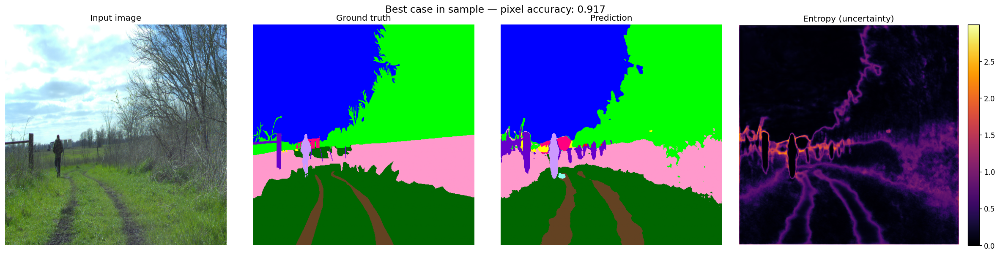
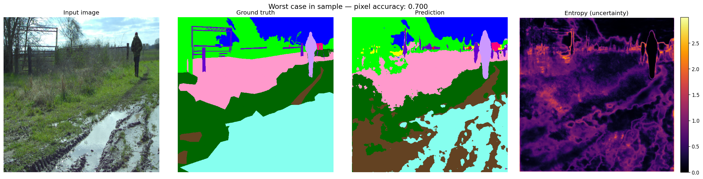
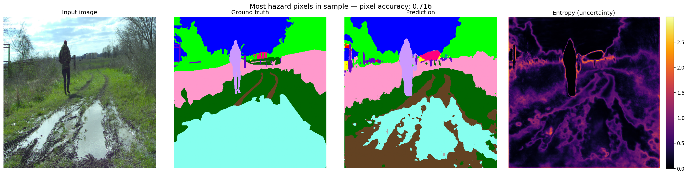
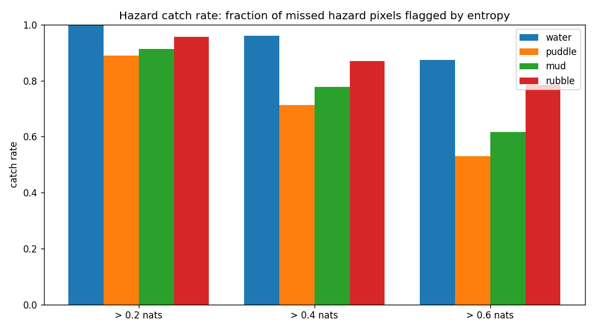
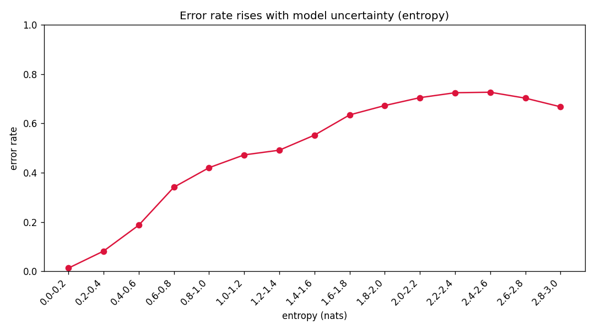
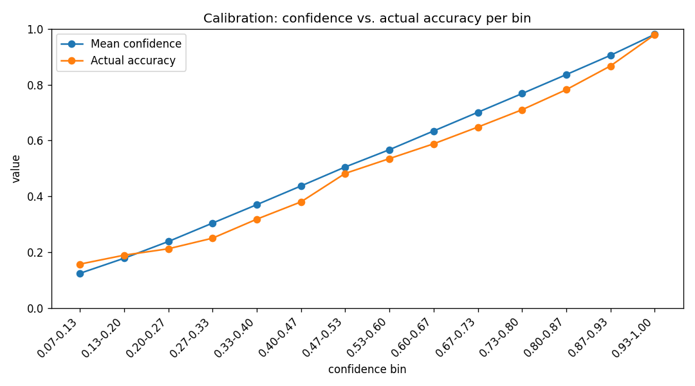

# Copernicus-Nav 

Completed Image Segmentation for the UGV...

## Terrain Segmentation Model

`segmodel_v1_2026-09-19` — a class-weighted checkpoint (epoch 8) selected for deployment over an unweighted alternative. The unweighted model scored slightly higher on aggregate mIoU, but never detected `person` or `log` at all (IoU 0.0 for both), meaning those obstacles were invisible to any downstream costmap. The weighted model trades a small amount of accuracy on common classes (grass, concrete) for detecting rare, safety-relevant ones.

| Metric | Unweighted | Weighted (deployed) |
|---|---|---|
| Overall mIoU | 0.3464 | 0.3310 |
| Hazardous mIoU | 0.3193 | 0.3079 |
| person IoU | 0.0000 | 0.4102 |
| log IoU | 0.0000 | 0.4108 |
| puddle recall | 0.4216 | 0.8481 |

Model export: ONNX, opset 17, SHA256 `23910cc4953e093c7d1c1b449f288b00a07934fdb07f4cf599da192de6fb7e0f`. Released as GitHub tag [`v1-segmodel-2026-09-19`](https://github.com/AryaShekhar13/Copernicus-Nav/releases/tag/v1-segmodel-2026-09-19).

## Example Predictions

Each panel shows: input image, ground truth, model prediction, entropy (uncertainty) heatmap.

### Best case

A clear frame with 91.7% pixel accuracy. Ground truth and prediction line up closely for large, well-defined regions (sky, grass, path). Entropy is low almost everywhere, correctly concentrated at object boundaries and around the person silhouette, exactly where uncertainty should be higher.

### Worst case

70.0% pixel accuracy. The clearest failure here is the puddle: in the input image it's one continuous water-filled rut, and ground truth marks it as a single clean region. The prediction instead breaks it into a fragmented patchwork of puddle and mud, confusing the two classes at the boundary. This is a visible instance of a pattern the numbers below confirm: mud is the hazard class the model struggles with most.

### Most hazard pixels in sample

A frame with a large concentration of hazard-class ground truth (water, puddle, mud, rubble combined). Useful for checking whether high-entropy regions in the uncertainty map line up with where the prediction disagrees with ground truth on hazard classes specifically, rather than just overall accuracy.

## Hazard Detection and Uncertainty Analysis

The model outputs a per-pixel entropy score alongside its segmentation, intended to flag pixels it is unsure about even when the class prediction itself is wrong. This was evaluated on hazardous classes (water, puddle, mud, rubble) using held-out test data (test.lst, 1672 frames).

Question: when the model misclassifies a hazard pixel, does its entropy score flag it as suspicious?

| Hazard | Missed pixels | Catch rate at 0.2 nats | at 0.4 nats | at 0.6 nats |
|---|---|---|---|---|
| water | 93,803 | 0.997 | 0.960 | 0.874 |
| puddle | 1,656,529 | 0.889 | 0.712 | 0.529 |
| mud | 815,235 | 0.914 | 0.777 | 0.617 |
| rubble | 170,786 | 0.957 | 0.870 | 0.786 |
| pooled | | 0.904 | 0.749 | 0.583 |

- Water has the worst raw detection recall (0.090) of any hazard, but the best uncertainty catch rate. When the model misses water, it is reliably uncertain about it rather than confidently wrong, the good-case outcome for a safety-oriented costmap.
- Mud is the weak point: the highest missed-pixel count and the lowest catch rate at every threshold. At a 0.6-nat threshold, 38% of missed mud pixels carry no uncertainty warning at all.
- A 0.2-nat threshold catches 90.4% of all missed hazard pixels pooled, at the cost of flagging a larger share of all pixels overall as uncertain (about 40%), a downstream planning/costmap cost, not a perception-accuracy one.

Caveat: these are pixel-level catch rates, not spatial. Whether the missed fraction (for example 13% of water at 0.6 nats) scatters randomly or clusters into one solid unflagged patch changes whether a threshold is actually safe in practice. This is the next check planned before treating any threshold as a final costmap parameter.

### Calibration

ECE (15-bin, non-void pixels): 0.0139. The pooled number is flattered by the fact that 71% of pixels fall in the top confidence bin (0.98 confidence, 0.979 accuracy), where calibration is near-perfect. Every mid-confidence bin (0.47 to 0.93) is overconfident by 3 to 6 percentage points. Mild, and not yet acted on; if corrected later, it should be via temperature scaling fit on a validation split, not test.

